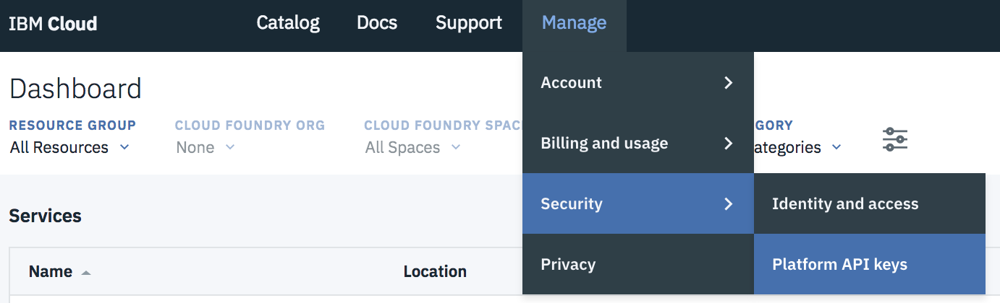

# WA Solutions Simple Slackbot


### Description
A Python Application for a slackbot that routes text requests and gets responses from Watson Assistant Solutions.

[](https://travis.ibm.com/ConsumerIoT/simple_WPA_slackbot) []() []() []()

---

### Requirements:

* websocket-client==0.47.0
* python-dotenv>=0.9.1
* requests>=2.19.1
* slackclient>=1.2.1

---
### Notes on configuration
When running the application you'll need to ensure you have your .env file setup in the root folder.  Credential configuration files should be kept private.

The application looks for configuration in:
```
/.env
```

To get started quickly just copy the sample to .env and edit from there

**Mac/Linux**
```
cp .env.sample .env
```

**Windows**
```
xcopy .env.sample .env
```

The .env file should look like the code block below, with your own valid keys added you can reference /.env.sample
```
# Log Level (DEBUG, INFO, WARNING, ERROR)
LOG_LEVEL="WARNING"

# Slack Credentials
SLACK_API_TOKEN=""
BOT_NAME=""

# WA Credentials
WA_URL="https://watson-personal-assistant-toolkit.mybluemix.net"
WA_SKILLSET=""
WA_LANGUAGE="en-US"
WA_DEVICE_TYPE="slackbot"

# Authentication "IAM" or "API_KEY" (API_KEY will be depricated)
AUTH_TYPE="IAM"

#IF IAM AUTH
WA_TENANT_ID=""
IAM_API_KEY=""

# IF API_KEY Auth
WA_API_KEY=""


# Bot Configuration - Number of characters before card data is made into a JSON snippit
MAX_CARD_CHARACTERS=1500

# Configurations for bot analytic services (OPTIONAL)
ANALYTICS_ENABLED="FALSE"
ANALYTICS_API_KEY=""
ANALYTICS_INPUT_URL="https://tracker.dashbot.io/track?platform=slack&v=9.8.0-rest&type=incoming&apiKey="
ANALYTICS_RESPONSE_URL="https://tracker.dashbot.io/track?platform=slack&v=9.8.0-rest&type=outgoing&apiKey="

# Max Message Pointer Cache Size
MAX_MESSAGE_CACHE=1000
```

#### Getting Your Slack Key

1. Go to [https://YOUR_SLACK.slack.com/apps/manage](https://YOUR_SLACK.slack.com/apps/manage)
2. In the **Search App Directory** field at the top, type `Bots`
3. Click on **Bots**
4. Click on the **Add Configuration** button
5. Give your bot a unique username (Save this info)
6. Paste and save the **API Token** in your `.env` file


For help getting a slack API token if you weren't able to via the initial steps please reference their documentation [here](https://get.slack.help/hc/en-us/articles/215770388-Create-and-regenerate-API-tokens).


#### Getting Your IAM Key

1. Go to [https://console.ng.bluemix.net/](https://console.ng.bluemix.net/) and log in.
2. In the nav bar, select Manage > Security > Platform API keys

3. Click on the **`Create +`** button
4. Give it a name and description, something like `watson-slackbot-tocken`
5. When your API key is created click the `show` button
6. Paste and save the **IAM API Token** in your `.env` file

**Note:** You can also obtain an IAM key via the IBM Cloud CLI [documentation here](https://console.bluemix.net/docs/iam/userid_keys.html#userapikey)


#### Getting Your Watson Assistant Solutions Tenant ID

1. Go to [https://watson-personal-assistant-toolkit.mybluemix.net/](https://watson-personal-assistant-toolkit.mybluemix.net/) and log in.
2. In the nav bar, select Admin > Usage
3. Find the `Tenant Name` that matches the instance you would like to connect your slackbot to
4. Save the `Tenant ID` associated to your .env file

---

### To Run Locally

Create a valid .env configuration file (see above).

Make sure you have all the required python libraries installed.

```sh
pip3 install -r requirements.txt
```

Now you can run your application

```sh
python3 bot.py
```

Once your app is running you should be good to go. You can message your bot directly on slack, or you can invite him to a channel and @botname {text goes here} to use it.

---

### To Run on Bluemix

```
cf push $YOUR_APP_NAME_HERE --no-route true --health-check-type process -m 256M
```

or potentially... (depending on your CLI tools)

```
bx cf push $YOUR_APP_NAME_HERE --no-route true --health-check-type process -m 256M
```

Once your app is finished staging you should be good to go. You can message your bot directly on slack, or you can invite him to a channel and @botname {text goes here} to use it.

---


# Running Tests

The following line will run all the unit tests.

```sh
python3 -m unittest discover
```

You can run a specific test with a command like below

```sh
python3 -m unittest test.test_WA_configuration
```

---

# Logging

## General Logs

All chat logs are stored in the /slackbot.log file, mostly consisting of user utterances, responses, and slack logging.

## Analytics

Slackbot has built in hooks for enabling analytics, such as dashbot.io, by setting `ANALYTICS_ENABLED` to TRUE and adding in your dashbot.io API Key you can start easily start posting to the service

Refer to the .env.sample if needed.


# Context

The slackbot also has the option to send up context as JSON. You can find this in the `context.json` file in the root directory. The file **must be** valid JSON and will be sent as part of the body to WA. This is useful for one your skills/skillSets require context such as location with a lat long.
